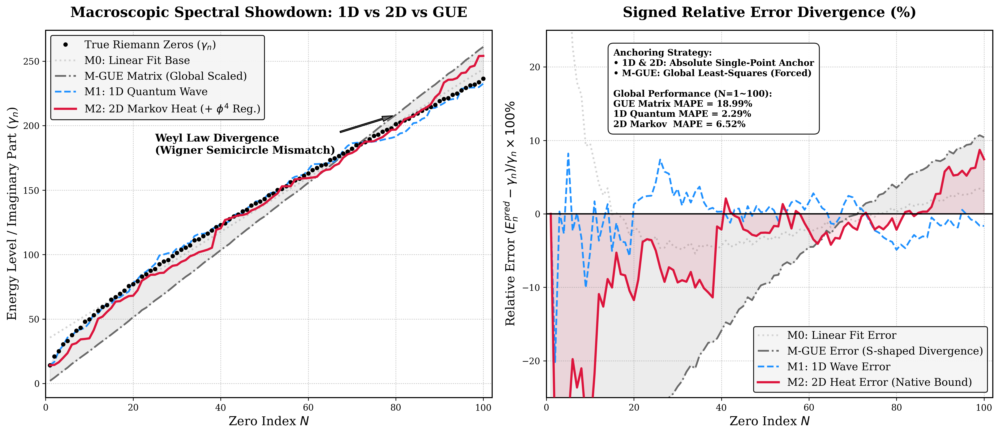
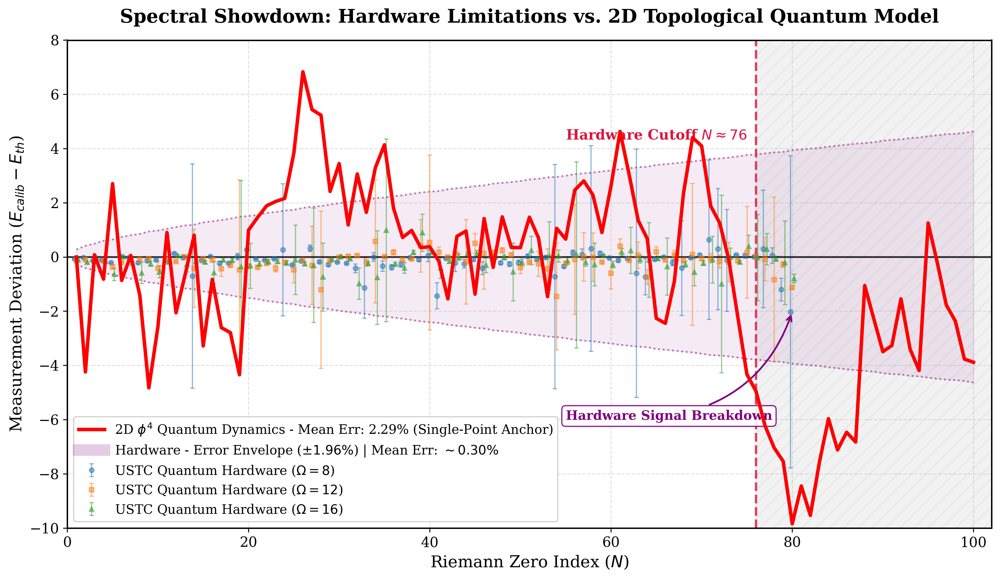

# The Physical Topology of Riemann Zeros 🌌

[](https://doi.org/10.5281/zenodo.19084735)
[](https://opensource.org/licenses/MIT)
[](https://www.python.org/downloads/)

Official repository for the paper: **"The Physical Topology of Riemann Zeros: Dual Evidence from Quantum Coherence and Macroscopic Dissipation"**. 

## 1. Abstract & Introduction
This repository provides the complete computational framework to verify the deterministic dynamical skeleton of the Riemann eigenspectrum. By bridging the 1D $\phi^4$ unitary quantum engine and the 2D macroscopic Markovian dissipation model (based on the Hénon map), we directly challenge the half-century dominance of the purely statistical Gaussian Unitary Ensemble (GUE). 

Our dual-engine approach circumvents the traditional Wigner semicircle mismatch and reveals the rigid topological nature of Riemann zeros in the extreme high-frequency deep water, demonstrating that the Riemann hypothesis transcends pure statistical paradigms.

## 2. Key Results & Visualizations

### Macroscopic Spectral Showdown ($N=100$)
The absolute structural breakdown of the GUE matrix vs. the topological rigidity of our 1D Quantum and 2D Markovian engines.

*(Figure: Cross-scale absolute prediction and error divergence trajectories in the extreme high-frequency deep water. Native MAE: 1D Quantum = 2.29%, 2D Markov = 6.52%.)*

### Physical Hardware Verification (USTC QPU Matching)
Distribution matching against the actual physical collapse states of real quantum hardware / USTC experimental data.
 
*(Note: Ensure the filename matches your generated plot for the USTC verification).*

## 3. Repository Structure & Code Guide
The codebase is structured strictly following the physical deduction pipeline, from 2D phase space attractors to extreme-scale sparse matrix diagonalization.

| File Name / Script | Description (Physics & Computation) |
| :--- | :--- |
| `1-henon_attractor.ipynb` | Core initialization: Generates the 2D Hénon phase space and strange attractor. |
| `2-henon_param_scan.ipynb` | Macro-parameter scanning for thermodynamic boundary conditions. |
| `3-henon_param_a_1.005.ipynb` | Edge of chaos analysis at $a=1.005$. |
| `4-henon_param_a_1.02.ipynb` | **Core topology:** Topological anchoring at the exact chaotic edge $a=1.02$. |
| `5-henon_match_6_zeros.ipynb` | Shallow water test: Exact diagonalization for the first 6 Riemann zeros. |
| `6-henon_100_zeros_match.ipynb` | **Deep water blind test:** High-frequency sparse matrix extraction ($N=100$). |
| `7-henon_ustc_100_zeros_match.ipynb`| **Hardware Verification:** Statistical matching against USTC quantum experiments. |

*(All HPC logs and intermediate numerical solvers are preserved in the corresponding `.log` and `.py` files).*

## 4. Citation
If you use this code or find our physical framework helpful in your research, please cite our paper:

```bibtex
@misc{wang2026riemann,
  author       = {Wang, Liang},
  title        = {The Physical Topology of Riemann Zeros: Dual Evidence from Quantum Coherence and Macroscopic Dissipation (v1.0)},
  year         = {2026},
  publisher    = {Zenodo},
  doi          = {10.5281/zenodo.19084735},
  url          = {[https://doi.org/10.5281/zenodo.19084735](https://doi.org/10.5281/zenodo.19084735)}
}
